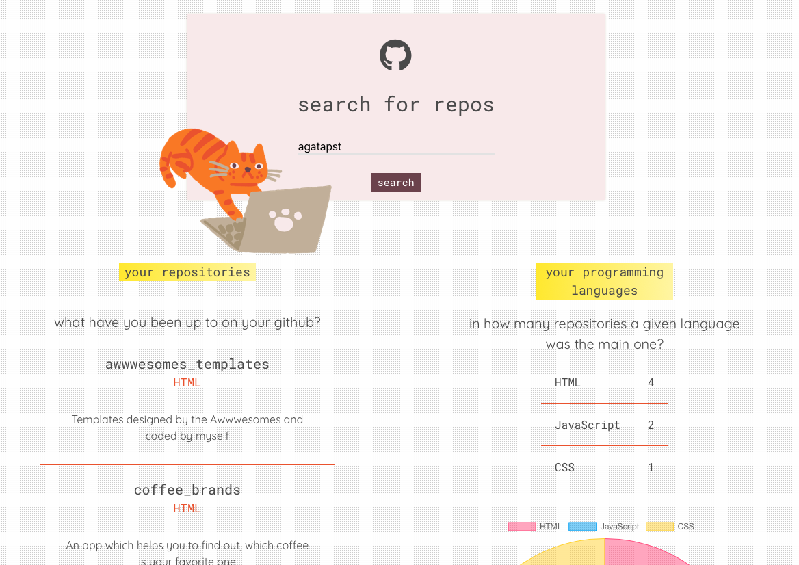

# Github preview
Github preview is an app to check out which programming language is used most in your github repositories.

[Website demo](https://agatapst.github.io/github_preview)

## Table of Contents
- General info
- Technologies
- Additional info

### General info
Project is an app, in which user can search for details (gained from GitHub API) about his GitHub repositories. After entering username, it is possible to check out names, main languages and descriptions of the repositories. There is also a chart presenting the information in how many repositories a given language was the main one.

### Technologies
- CSS3
- HTML5
- JavaScript
- GitHub API
- Chart.js
- Bulma

### Additional info
The whole app structure and project layout were designed by me.

Cat image was downloaded from [Icons8](https://icons8.com).